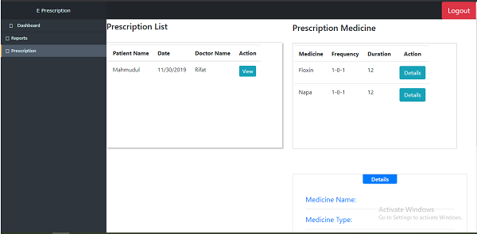

# E-prescription
### Run the project
  * install djanog
  * run 'python manage.py makemigrations'
  * run 'python manage.py migrate'
  * run 'python manage.py runserver'
  * run 'python manage.py createsuperuser' to create super admin
### Project Screenshot 
 * Doctor create prescription 
 * Doctor search prescription 
 * Patient check prescription 

## Objective
1. will be able to collect information about those who are selling medicine without prescription
2. allow the patient not to carrying prescription
3. doctor can easily access all the prescription of his patients and create prescription for patient 
4. pharmacist and company will be able to maintain their medicine stock

## Motivation
The antibiotic resistance is a serious issue in our country. A concern amount of children in born in our country with antibiotic resistance. Their parents are responsible for this. When we take antibiotic irregularly the gradually our body became antibiotic resistance and our children also born with antibiotic resistance. People take antibiotic without prescription and there are some people selling this medicine without any prescription. There are some other medicines that can be used for intoxication. If we can get information about those who are selling medicine without prescription then we can stop them. This inspire us to work on this project. 

## Stakeholders 
Developer, Doctor, Company, Pharmacist.

## Functional Features 
 **Company**
   * Add medicine, price and details of the medicine
   * Update price of any medicine if necessary
   * Take medicine order 

 **Doctor**
  *	Can see all registered medicines under his/her number
  *	Make a prescription for a patient
  *	Edit any prescription
  *	Check out all made prescription
 
 **Patient**
   * Can see all prescriptions under his/her registered number

 **Pharmacist**
   * Maintain medicine stock
   * Order medicine
   
## Resources 
* Framework: Django 
* CSS Framework : Bootstrap 
* Javascript Frameworks/Libraries
   * jQuery 3.4.1
   

 
